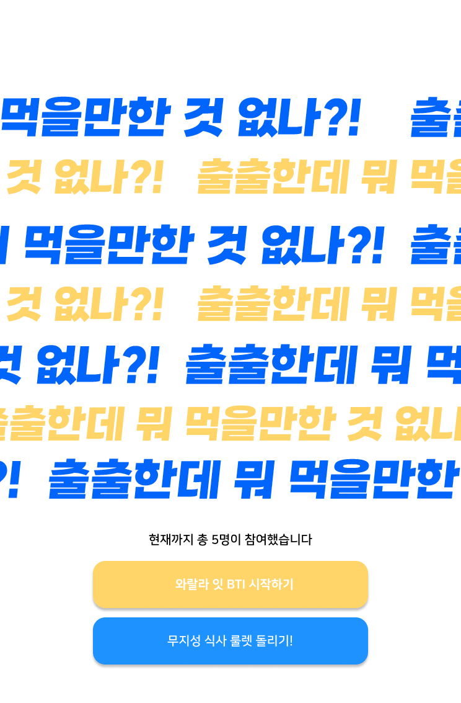
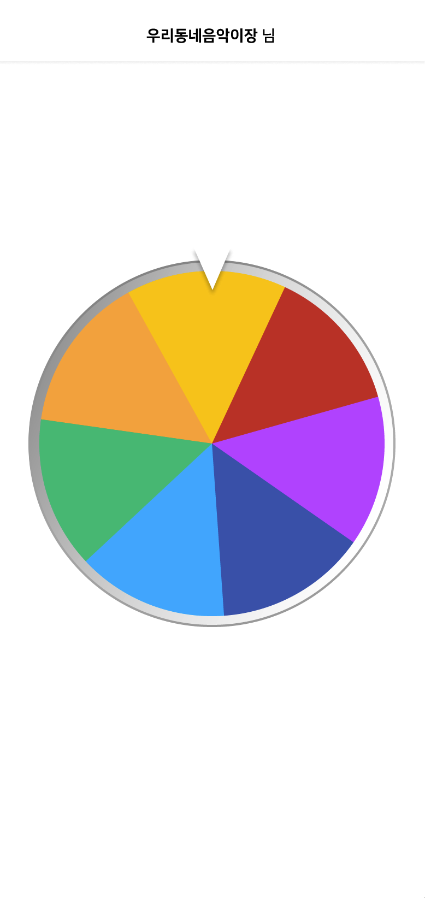
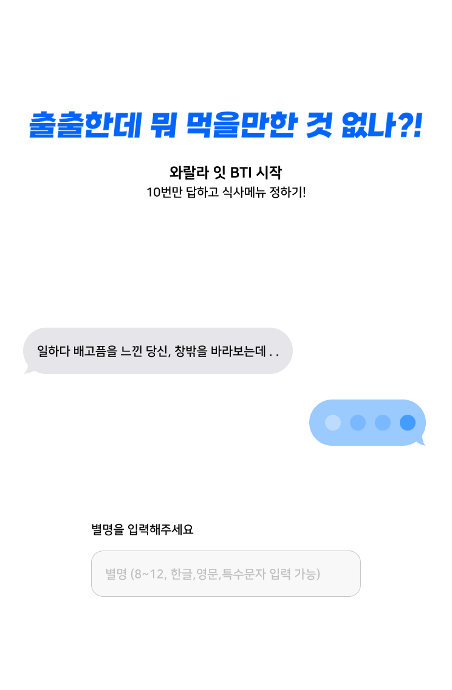
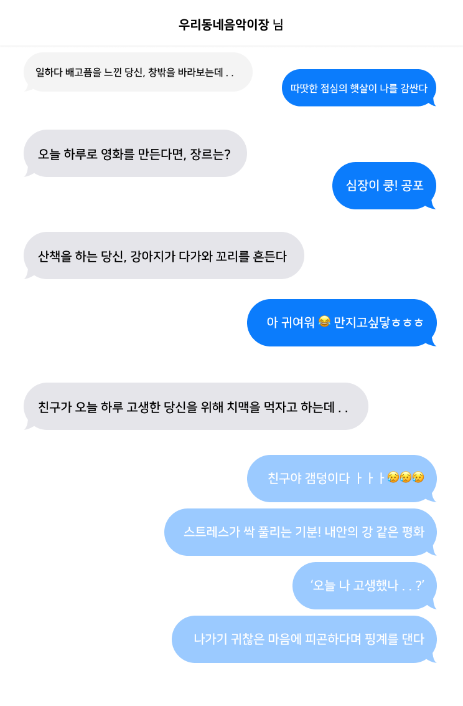
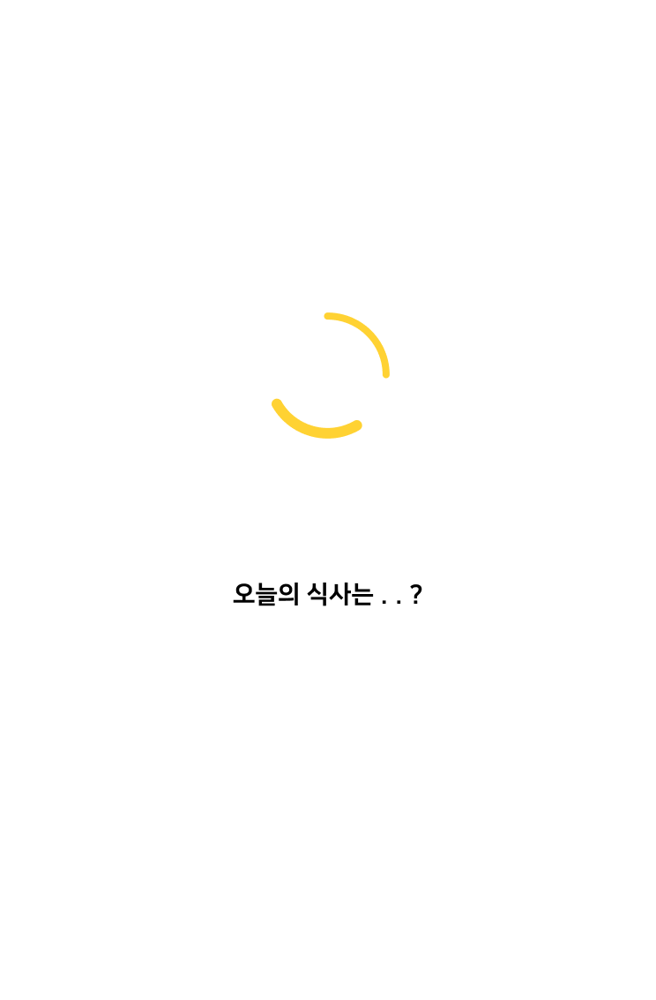
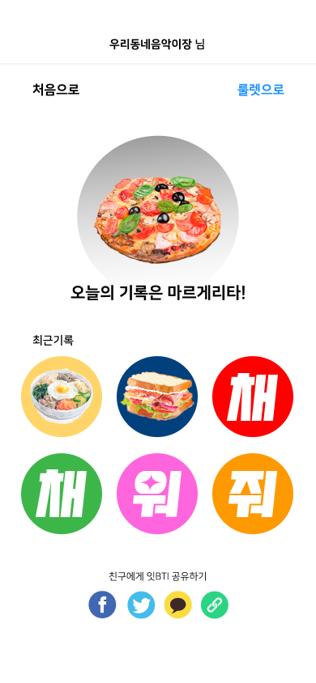

# 와랄라먹bti
SW중심대학 공동해커톤 2022 참가 프로젝트입니다. (2022.06.22~2022.06.24)

## 프로젝트 소개
재밌는 단 10개의 설문을 통해 4글자로 된 나의 음식 취향과 추천 메뉴를 알려주는 서비스입니다.

## 개발 스펙
react, typescript, html, css

## 팀원 구성
와장창점메추 팀

||||
|-|-|-|
|Design   | 신예준    ||
|Front-end| 고대화   @daehwa00 |오하형   @maryoh2003 |
|Back-end | 한승원   @SW-H||

## 실행 예시 화면
 

 

 

